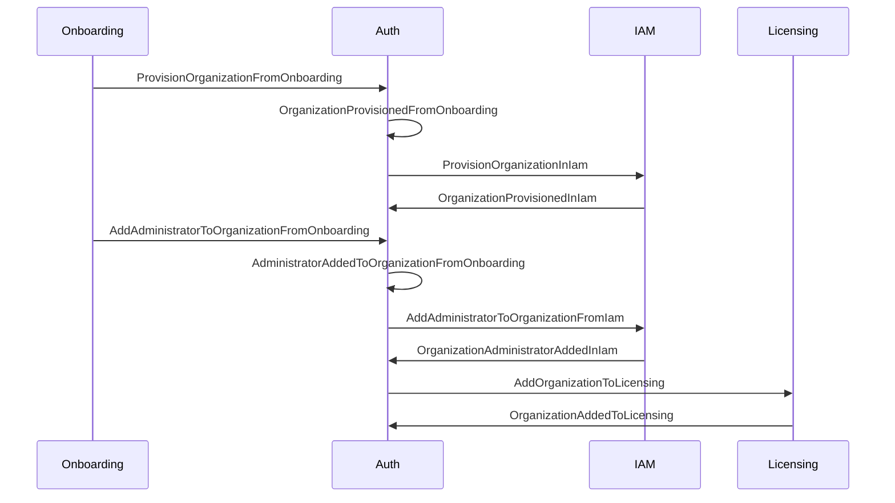

# Command template, command→event mapping, and handler naming

*Read this when naming a command specifically, tracing a command through to the event(s) it
produces, or naming a policy/event/command handler.*

## The canonical command template

`[ImperativeVerb][Resource][In][ExecutionContext][From][Source][By][Actor][Via][Trigger]`

Example: `CreateUserInIamFromOnboardingBySyncServiceViaApiRequest`

| Part | Meaning | Example |
| --- | --- | --- |
| **ImperativeVerb** | Action to perform | `Create`, `Update`, `Sync`, `Import`, `Apply` |
| **Resource** | Primary entity | `User`, `Organization` |
| **In[ExecutionContext]** | **Where** to execute | `InIam`, `InDatabase` |
| **From[Source]** | **Where** data comes from | `FromIam`, `FromOnboarding` |
| **By[Actor]** | **Who** issues the command | `ByUser`, `BySyncService` |
| **Via[Trigger]** | **How** it was triggered | `ViaApi`, `ViaUi` |

Commands use the same simplification rules as events (`omission-rules.md`).

Worked example, start to finish:

`CreateUserInOurSystemFromOnboardingBySyncServiceViaApiRequest`

1. `InOurSystem` → always omit (execution context defaults to this domain)
   → `CreateUserFromOnboardingBySyncServiceViaApiRequest`
2. `By[Actor]` → omit unless the actor is a user, an external system, or a cross-service call
   needing audit
   → `CreateUserFromOnboardingViaApiRequest`
3. `Via[Trigger]` → omit unless the trigger changes timing (real-time vs batch) or source (UI,
   API, webhook)
   → `CreateUserFromOnboarding`

Final: `CreateUserFromOnboarding`

## Command → event mapping

Commands and events generally follow one another, and the same template gives a readable
semantic continuation between the two:

| Command | Event |
| --- | --- |
| `CreateUserInIam` | `UserCreatedInIam` |
| `ImportUserFromIam` | `UserImportedFromIam` |
| `UpdateUserFromOnboarding` | `UserUpdatedFromOnboarding` |
| `SyncOrganizationFromIam` | `OrganizationSyncedFromIam` |

A larger process reads cleanly from the names alone. Example: provision an organization from
onboarding; when provisioned, provision it in IAM; when an administrator is added to the
organization, add them to IAM; when added to IAM, add the organization to licensing.

Naming each step through the template makes the process itself readable without a narrative
alongside it — that readability is the return on applying the template consistently.

## Naming handlers

Handler naming does not pertain to the name of an event or command directly, but follows from
what the handler groups:

- **Handler implementing a policy from event storming** → name of that policy, suffixed
  `Policy`. Example: `OrganizationProvisioningPolicy`.
- **Handler for a group of commands or events** → subject of those commands/events, suffixed
  `Handlers`. Example: `IamHandlers`.
- **Handler for events from a specific input mechanism** → name of that integration, suffixed
  `Integration`. Example: `CdcHandlers`, `WebhookHandlers`.
- **Handler for a specific domain** → name of that domain, suffixed `Domain` or `Handlers`.
  Example: `OnboardingHandlers`, `IamHandlers`, `LicensingHandlers`.

This should generally map to the subsystem boundary defined in event storming. That mapping is
not always reliable — especially when hunting for the subsystem's name — so when a compelling
name is discovered through the work itself, let the subsystem name conform to it rather than
forcing the reverse. If the subsystem is well-defined, the handler or policy name should be
self-evident from it.
